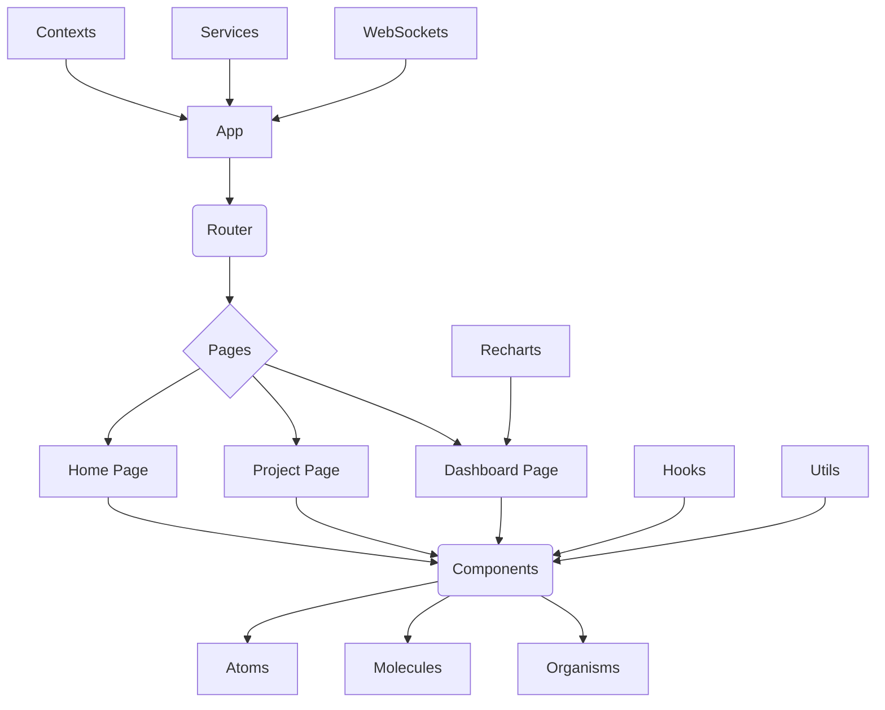

# CollabHubBR - Front-End Web


<!--  -->

Este repositório contém o código-fonte do **Front-End Web** do **CollabHubBR**, a plataforma brasileira de coordenação e organização de projetos de código-aberto. Construído com **React** e **Vite** para uma experiência de desenvolvimento rápida e eficiente, esta aplicação oferece uma interface intuitiva e responsível para os usuários interagirem com os projetos, participarem de enquetes, acompanharem roadmaps e visualizarem métricas importantes.

Utilizamos **WebSockets** para notificações em tempo real, garantindo que você esteja sempre atualizado sobre as novidades do seu projeto. Seja uma nova enquete, uma milestone alcançada ou um comentário em uma discussão, as notificações chegam instantaneamente. Além disso, o **Recharts** é integrado para criar dashboards visuais e interativos, transformando dados complexos em insights claros e acionáveis, auxiliando na tomada de decisões **driven-by-community**. Nosso objetivo é proporcionar uma experiência fluida e colaborativa, fortalecendo o engajamento e a participação da comunidade em projetos Open Source.

## Stack


<!--  -->
<!--  -->


<!--  -->


## Arquitetura

A arquitetura do Front-End Web do CollabHubBR segue os princípios do React, priorizando a **componetização**, a **reusabilidade** e a **manutenibilidade** do código. Adotamos uma estrutura de pastas modular para organizar nossos componentes, hooks, contextos e utilitários.



### Estrutura de Pastas

Abaixo, descrevemos a organização principal das pastas do projeto:

-   `src/`: Contém todo o código-fonte da aplicação.
    -   `assets/`: Imagens, ícones, fontes e outros recursos estáticos.
    -   `components/`: Componentes React reutilizáveis, divididos por nível de complexidade (Atoms, Molecules, Organisms).
    -   `contexts/`: Contextos React para gerenciamento de estado global (autenticação, tema, etc.).
    -   `hooks/`: Hooks personalizados para lógica reutilizável.
    -   `pages/`: Componentes de página, representando as diferentes rotas da aplicação.
    -   `services/`: Módulos para integração com APIs externas e serviços de backend (e.g., comunicação com WebSockets).
    -   `styles/`: Arquivos de estilos globais ou temas.
    -   `utils/`: Funções utilitárias e helpers.
    -   `App.tsx`: Componente principal da aplicação.
    -   `main.tsx`: Ponto de entrada da aplicação.

### Instalação de Dependências

```bash
npm install
```

### Servidor Local

```bash
npm run dev
```

### Build de Produção

```bash
npm run build
```

### Execução de Testes

```bash
npm test
```

### Linter

```bash
npm run lint
```

## To-Do List

Confira a [To-Do List aqui](https://github.com/CollabHubBR/frontend-web/blob/main/.github/TODO.md)

## Contrib

Antes de contribuir ativamente com o projeto é **fortemente recomendada** a leitura dos documentos abaixo:

-   [Código de Conduta](https://github.com/CollabHubBR/.github/blob/main/CODE_OF_CONDUCT.md)
-   [Contribuindo](https://github.com/CollabHubBR/.github/blob/main/CONTRIBUTING.md)
-   [Segurança](https://github.com/CollabHubBR/.github/blob/main/SECURITY.md)
-   [Suporte](https://github.com/CollabHubBR/.github/blob/main/SUPPORT.md)

## Licença

This project is under [MIT - Massachusetts Institute of Technology](https://choosealicense.com/licenses/mit/). A short and simple permissive license with conditions only requiring preservation of copyright and license notices. Licensed works, modifications, and larger works may be distributed under different terms and without source code.
